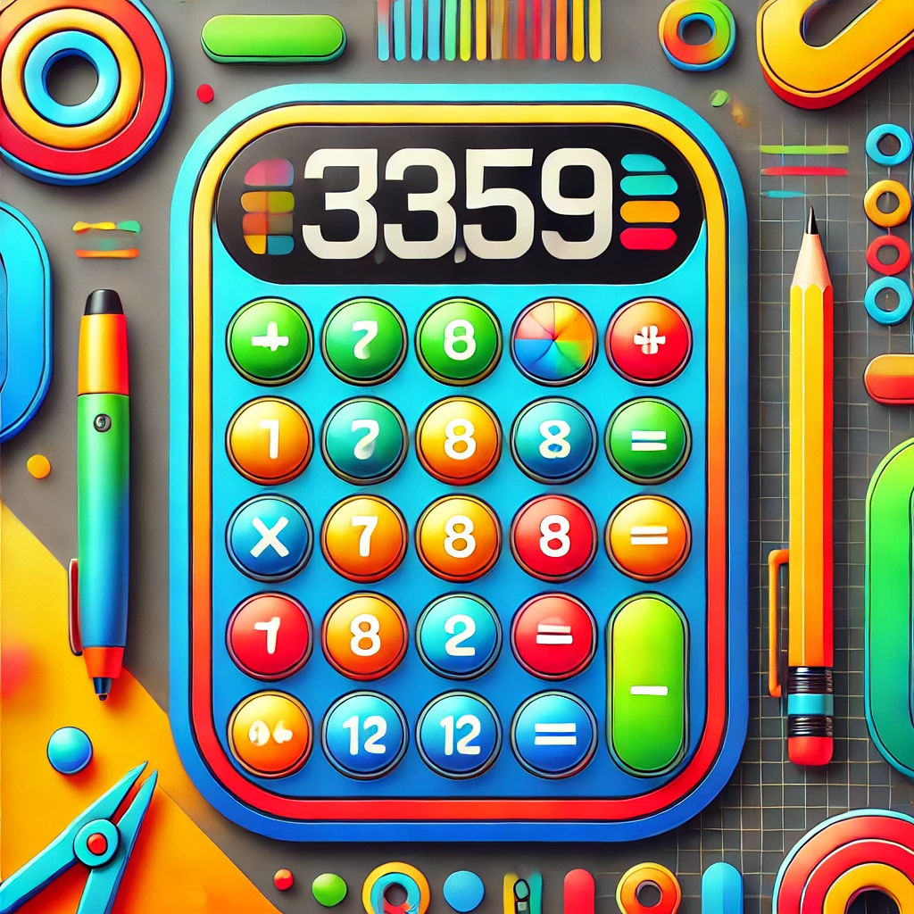

# Creative Brief: CountCraft Educational Calculator

## 1. Brand Overview

**Company/Organization Name:** CountCraft

**Industry/Sector:** Educational Technology

**Mission Statement:** To make mathematics engaging, accessible, and fun for students of all ages through innovative educational tools.

**Brand History:** CountCraft is a new venture in the educational technology space, founded by passionate educators and technologists with the goal of revolutionizing how students interact with and learn mathematics.

**Core Values:**
- Innovation in education
- Accessibility and inclusivity
- Fun and engagement in learning
- Empowerment through knowledge

**Target Audience:** 
- Primary: Students aged 8-18
- Secondary: Teachers and parents

## 2. Brand Identity

**Brand Essence:** Empowering mathematical discovery through interactive technology

**Key Attributes to Communicate:**
- User-friendly
- Educational
- Innovative
- Reliable

**Emotional Response to Evoke:**
- Curiosity
- Confidence
- Excitement about learning

**Visual Style Direction:**
- Colorful and playful, yet professional
- Clean lines and clear, readable fonts
- Balanced design appealing to students, teachers, and parents

**Brand Voice and Tone:**
- Friendly and encouraging
- Clear and instructive
- Occasionally playful, but always informative

**Brand Personality:**
- Intelligent
- Approachable
- Enthusiastic
- Trustworthy

## 3. Product/Service Information

**Main Offerings:** CountCraft Educational Calculator

**Unique Selling Proposition (USP):** CountCraft combines the functionality of a standard calculator with interactive educational features, making it a comprehensive tool for learning and applying mathematical concepts.

**Key Benefits:**
- Enhances understanding of mathematical concepts
- Provides step-by-step problem-solving guidance
- Offers customizable difficulty levels for different age groups
- Includes gamified elements to make learning fun

## 4. Market Analysis

**Competitors:**
- Traditional calculator brands (e.g., Texas Instruments, Casio)
- Educational math apps and websites

**Market Position:** Premium educational tool bridging the gap between traditional calculators and digital learning platforms

**SWOT Analysis:**
- Strengths: Innovative features, educational focus, user-friendly design
- Weaknesses: New brand, potentially higher cost than basic calculators
- Opportunities: Growing emphasis on STEM education, increasing use of technology in classrooms
- Threats: Established calculator brands, free online math tools

## 5. Campaign Briefs (3 Options)

### Campaign Option 1: "Math Adventures with CountCraft"

- **Objective:** Position CountCraft as an exciting tool for mathematical exploration and learning
- **Target Audience:** Students aged 8-14 and their parents
- **Key Message:** "Turn math into an adventure with CountCraft!"
- **Desired Outcome:** Increase brand awareness and drive early adoption among younger students
- **Tone and Style:** Playful, adventurous, and encouraging
- **Specific Requirements:** 
  - Create characters or mascots representing different math concepts
  - Develop a series of "math quests" that showcase the calculator's features

### Campaign Option 2: "CountCraft: Your Partner in STEM Success"

- **Objective:** Establish CountCraft as an essential tool for advanced STEM education
- **Target Audience:** High school students (14-18) and STEM teachers
- **Key Message:** "Elevate your STEM potential with CountCraft"
- **Desired Outcome:** Drive adoption in high schools and increase brand credibility in advanced education
- **Tone and Style:** Professional, inspiring, and forward-thinking
- **Specific Requirements:**
  - Highlight advanced features suitable for higher-level math and science
  - Showcase testimonials from STEM professionals and educators

### Campaign Option 3: "CountCraft Classroom: Empowering Educators"

- **Objective:** Position CountCraft as an indispensable teaching aid for math educators
- **Target Audience:** Teachers and school administrators
- **Key Message:** "Transform your math classroom with CountCraft"
- **Desired Outcome:** Secure partnerships with schools and educational districts
- **Tone and Style:** Informative, supportive, and solution-oriented
- **Specific Requirements:**
  - Develop resources for lesson planning and classroom integration
  - Create case studies showing improved student engagement and performance

## 6. Design Requirements

**Logo and Branding Guidelines:**
- Develop a logo that incorporates mathematical symbols or concepts
- Use a color palette that is vibrant yet professional (e.g., blue, green, orange accents)
- Choose modern, clean fonts that are easily readable on both digital screens and the calculator display

**Product Packaging:**
- Create eco-friendly packaging that showcases the calculator's features
- Include QR codes linking to tutorial videos or additional online resources

**Print Deliverables:**
1. Informational brochure for teachers and parents
2. Poster for classroom display

**Digital Deliverables:**
1. Animated explainer video for the CountCraft website
2. Social media graphics for launch campaign

**Multipage Layout:**
- Design a 12-page digital brochure detailing CountCraft's features, benefits, and testimonials from beta testers
